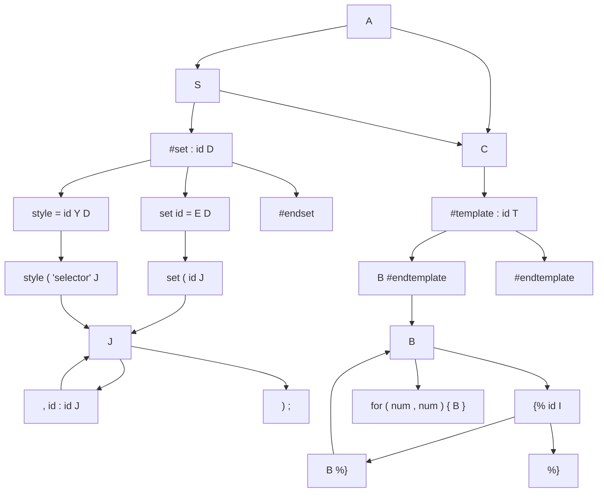

Very Simple Language Parser
====

Descripción del Lenguaje
---
Define en una sola sintaxis elementos de HTML y CSS utilizando objetos que describen carateristicas de tags de HTML y reglas de CSS

Detecta errores de token inválidos, errores de sintaxis y uso invalido de objetos no definidos

Descripción del compilador/intérprete
---

  Python 2.7 con los modulos de expresiones regulares
  
  No se utilizan librerías externas.

Descripción de análisis léxico
------------
Patrones de construcción

```
    INISET   =  \#set
    NAMETAG  =  \:
    SET      =  set
    STYLE    =  style
    EQUALS   =  \=
    ENDSET   =  \#endset
    LPAR     =  \(
    RPAR     =  \)
    COMMA    =  \,
    APOS     =  \'
    DOTCOMMA =  \;
    INITEMP  =  \#template
    ENDTEMP  =  \#endtemplate
    ININEST  =  \{\%
    ENDNEST  =  \%\}
    FOR      =  for
    SELE     =  \#|\.\w+
    NUM      =  [1-9][0-9]*
    ID       =  (-|\w)+
    LKEY     =  \{
    RKEY     =  \}
```

Descripción de análisis sintáctico
---
Gramática Formal



Se utilizó un parser LL de implementación propia. Se realiza análisis de First y Follow, se crea la tabla de parseo y se realiza el análisis semántico, al tiempo que se genera la entrada para análisis semantico.

Descripción de análisis semántico y generación de código intermedio
---
Luego del análisis sintáctico, pasamos la entrada a código intermedio con representación de cuadruplos, en donde se lleva un control de las variables declaradas y se detecta error en caso de usar variables no declaradas previamente.

Se diseñaron cuadruplos para la representación intermedia del código de entrada y se muestran al final del análisis


Descripción del ejecutor
---
*Coming soon*

